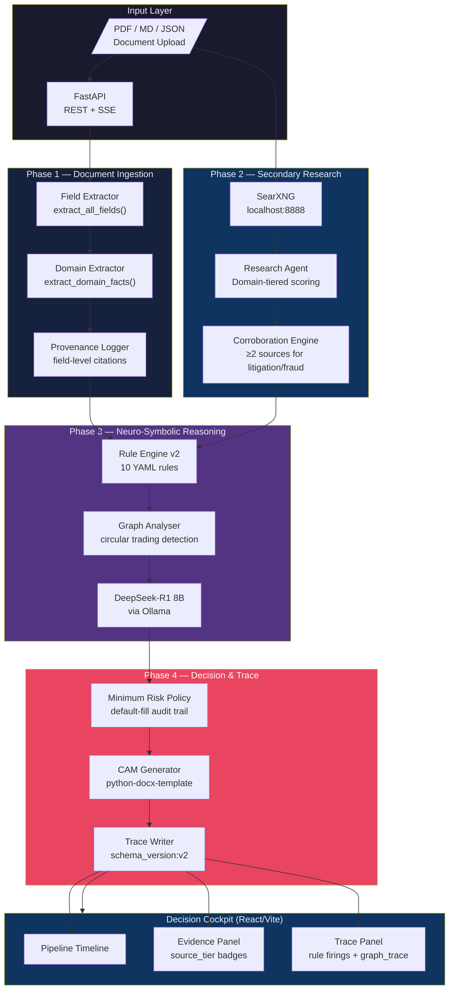

# Intelli-Credit — Architecture & Presentation

> AI-Augmented MSME Credit Decisioning Engine  
> Phase 2 — Judge-Ready Build

---

## System Architecture



---

## Key Technical Choices

### 1. Rule Engine v2 — Auditable by Design
Every credit decision is backed by a YAML rule file that specifies:
- Threshold bands with explicit `risk_adjustment` per level
- `direction: above|below` for bi-directional thresholds
- `hard_reject: true` for non-negotiable constraints (circular trading)
- `schema_version: "2.0"` enforced on every rule to prevent silent zero-bugs

This means the system can be audited by a non-technical credit officer who reads the rule files directly.

### 2. Research Corroboration Policy
The research agent enforces a **minimum 2-source requirement** for litigation and fraud claims:
- Single-source claims are tagged `insufficient_corroboration: true` and downgraded to `risk_impact: "unverified"`
- Each finding carries `source_tier` (authoritative / credible / general / low) and `relevance_score`
- Auto-promote fabrication (guaranteeing minimum 3 findings) has been **removed** — honesty > padding

### 3. Minimum Risk Policy Transparency
When input documents lack specific facts (e.g., no collateral value provided), the system:
- Applies a **conservative default** (not silence)
- Records every default in `minimum_risk_policy[]` with `{field, default_value, reason}`
- Renders these in the UI as an amber audit trail

This prevents conservative defaults from being hidden while still ensuring the engine doesn't fail.

### 4. Trace Contract (schema_version: v2)
The JSON trace emitted by every pipeline run is a versioned contract:

```json
{
  "schema_version": "v2",
  "rule_firings": [...],
  "rules_fired_count": 3,
  "minimum_risk_policy": [...],
  "graph_trace": {
    "edges_examined": 12,
    "suspicious_cycles": 1,
    "fraud_alerts": 1,
    "no_graph_evidence": false
  },
  "decision": {
    "recommendation": "REJECT",
    "risk_score": 0.95,
    "recommended_amount": 0
  }
}
```

Breaking changes require a `schema_version` bump, ensuring the frontend and tests always know what to expect.

### 5. SSE Streaming — Live Decision Feed
The pipeline runs in a background thread and streams progress as Server-Sent Events:
```
progress  → { phase: "ingestion", message: "..." }
research_complete → { findings_count: 5, negative_count: 2 }
progress  → { phase: "reasoning", message: "..." }
complete  → { recommendation: "REJECT", risk_score: 0.95, rules_fired_count: 3 }
```
The React frontend connects via `EventSource` and updates the pipeline timeline in real time. EventSource refs are properly cleaned up on unmount to prevent ghost connections.

---

## Three-Case Demonstration

| Company | Sector | Loan | Signal | Expected |
|---------|--------|------|--------|----------|
| Sunrise Textiles Pvt Ltd | Textile Manufacturing | ₹50L | CMR=3, DPD=0, clean ITC | **APPROVE** |
| Apex Steel Components Ltd | Steel (Auto Ancillary) | ₹150L | CMR=6, DPD=45, ITC excess 33% | **CONDITIONAL** |
| Greenfield Pharma Industries | Pharmaceutical Chemicals | ₹250L | CMR=9, DPD=120, circular GST, criminal cases | **REJECT** |

Run the showdown:
```bash
./scripts/demo_showdown.sh
```

---

## Real-World Rollout Path

### Phase 1 (Current MVP)
- On-premise deployment for co-operative banks and NBFCs
- OCR pipeline replaces manual PDF data entry (~4 hours → ~4 minutes)
- Rule engine provides consistent, auditable decisions vs. relationship-banker subjectivity

### Phase 2 (6 months)
- Integration with CIBIL API for live CMR pulls
- GST e-invoice API for real-time GSTR-2A vs 3B reconciliation
- RBI-compliant audit log export (per Digital Lending Guidelines 2022)

### Phase 3 (12 months)
- Federated training on anonymised consent-based data across partner banks
- Dynamic rule updates via human-in-the-loop workflow (credit committee approval)
- Multi-lender consortium credit bureau contribution

---

## Project Stats

| Metric | Value |
|--------|-------|
| Test coverage (unit + integration) | 52 tests (50 pass, 2 skipped) |
| Rule files | 10 YAML rules |
| Pipeline phases | 5 (Ingestion → Research → Graph → Reasoning → CAM) |
| Frontend modules | 37 (Vite build) |
| Research domain blocklist | 26 noisy domains |
| Domain confidence tiers | 25 entries (RBI/SEBI = 0.95) |
| LLM | DeepSeek-R1 8B (local Ollama, Q8) |
| Stack | FastAPI + React/Vite + Tailwind + DuckDB |
